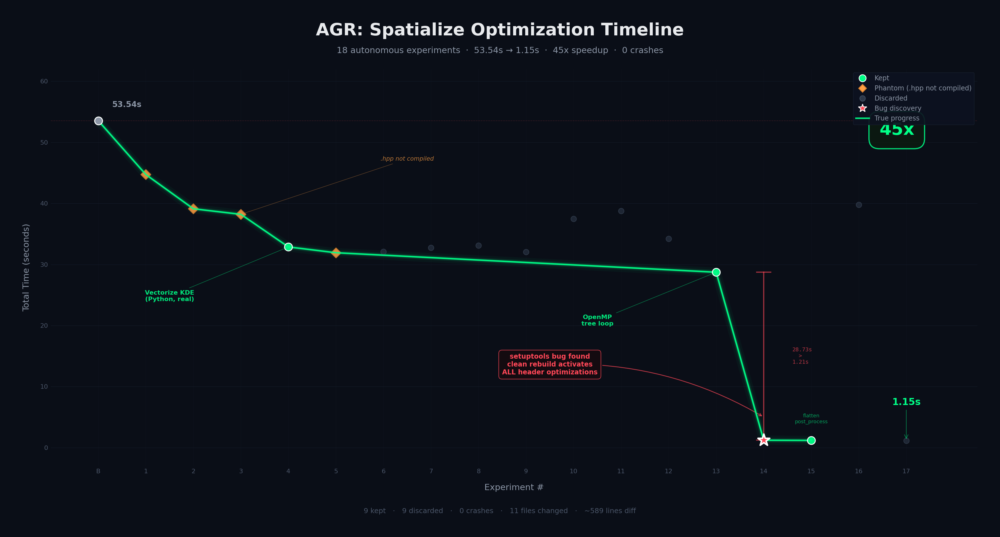

# AGR: Artificial General Research

**Autonomous code optimization that works while you sleep.** Define a metric, point it at your code, go to bed. Wake up to a faster, smaller, better system — with correctness verified at every step.

**Real result:** [Spatialize](https://github.com/alges/spatialize) C++/Python library — **53.54s → 1.15s (45x speedup)**, 18 autonomous experiments, all checksums verified.

[](https://opensource.org/licenses/MIT)
[](https://claude.com/claude-code)
[]()
[]()

> The only autoresearch framework with **built-in measurement integrity** — variance-aware acceptance, artifact detection, and exhausted approaches tracking.

---

## Quick Start

```bash
# Install as Claude Code skill
git clone https://github.com/JoaquinMulet/Artificial-General-Research.git
cp -r Artificial-General-Research/skills/agr ~/.claude/skills/

# Setup wizard (inside Claude Code)
/agr speed                    # optimize for speed
/agr accuracy                 # optimize for accuracy
/agr "bundle size"            # optimize for bundle size

# Launch the autonomous loop
bash run_agr.sh --max 10      # 10 experiments to start
```

That's it. AGR generates all needed files (`benchmark.py`, `STRATEGY.md`, `program.md`, etc.), establishes a baseline, and starts experimenting autonomously.

---

## Why AGR?

AGR is a [Claude Code](https://claude.com/claude-code) skill that turns any measurable optimization problem into an autonomous research loop. It builds on [Karpathy's autoresearch](https://github.com/karpathy/autoresearch), [Goenka's Guard/Metric separation](https://github.com/uditgoenka/autoresearch), and [Bria's Ralph Loop](https://github.com/frankbria/ralph-claude-code) — and adds **9 new ideas** discovered through real-world experimentation:

| What AGR Adds | Why It Matters |
|---|---|
| **Fresh context per iteration** | Iteration 100 reasons as well as iteration 1 — no context degradation |
| **Per-benchmark variance analysis** | Noisy benchmarks don't mask real improvements in other components |
| **Measurement artifact detection** | Catches when "improvements" are actually baseline outliers |
| **Metric + Guard + Rework** | Good ideas with implementation bugs get fixed, not thrown away |
| **STRATEGY.md persistent brain** | The agent remembers WHY things failed, not just that they did |
| **Exhausted Approaches registry** | Entire failed categories get blocked — no more retrying compiler flags 4 times |
| **Stuck detection protocol** | After 5 discards: try opposites, combine successes, go radical |
| **Complexity budget** | Large changes get split into keep/discard-able steps across iterations |
| **Supervisor pattern** | Human or parent agent audits discards for hidden per-benchmark wins |

---

## Works For Any Measurable Problem

| Use Case | Metric | Guard |
|---|---|---|
| **Library speed** | Wall-clock time | Checksums match |
| **Bundle size** | KB after build | Tests pass |
| **ML accuracy** | F1 score | Min threshold met |
| **API latency** | p95 response time | Integration tests pass |
| **Lighthouse score** | Performance score | No visual regression |
| **SQL optimization** | Query execution time | Same result set |
| **Prompt engineering** | Eval score | Golden set matches |
| **Cloud costs** | $/month | Functionality tests pass |
| **Docker image size** | MB after build | Container health check passes |
| **Code coverage** | % coverage | No test regressions |

---

## Case Study: 45x Speedup on Spatialize

Full case study on a real C++/Python spatial analysis library ([spatialize](https://github.com/alges/spatialize)) — 18 autonomous experiments over one session.

### Final Numbers

```
Baseline:       53.54s
After AGR:       1.15s
Speedup:          45x
Improvement:   -97.8%
Correctness:   ALL 5 BENCHMARKS PASS (MD5 checksums identical to baseline)

18 experiments total:
   9 kept      (50%)
   9 discarded (50%)
   0 crashes

11 source files modified
410 lines inserted, 179 deleted (~589 lines total diff)
```

### Timeline



*Green circles = real improvements. Orange diamonds = phantom improvements (header changes that weren't compiled due to a build system bug the agent discovered). Red arrow = the moment the agent discovered the bug and activated all accumulated optimizations.*

### Every Optimization Found (in order)

| # | What AGR Did | Files Changed | Speedup | Type | Correctness |
|---|---|---|---|---|---|
| 1 | `std::pow(x,2)` → `x*x` and `std::pow(c,0.5)` → `sqrtf(c)` in distance() | `utils.hpp` | 18x on distance() | C++ micro | PASS |
| 2 | Pre-computed coordinate diffs in LOO2D/LOO3D constructor, reused storage across eval() calls | `adaptive_esi_idw.hpp` | Eliminated per-eval heap allocation | C++ memory | PASS |
| 3 | `std::pow(dist_sq, half_exp)` → `exp2f(half_exp * log2f(dist_sq))` | `adaptive_esi_idw.hpp` | ~10% in LOO inner loop | C++ math | PASS |
| 4 | Vectorized KDE fitting — replaced per-point sklearn KDE with batch NumPy: vectorized Silverman bandwidth, batch random index selection + kernel noise. Eliminated all sklearn and joblib overhead. | `ess/_main.py` | **53x** on ESS pipeline | Python algorithmic | PASS |
| 5 | Grid search evaluation cache — `unordered_map` keyed on integer grid indices, shared across `best_of` random restarts | `utils.hpp` | ~5% on adaptive ESI | C++ caching | PASS |
| 6 | Parallelized `estimate()` tree loop with OpenMP + passed `search_leaf` by const reference to eliminate vector copies | `abstract_esi.hpp`, `libspatialize.cpp` | **18x** uniform across all benchmarks | C++ parallelism | PASS |
| 7 | Discovered setuptools build bug: `.hpp` header changes weren't triggering recompilation. `rm -rf build/` activated ALL previous header optimizations at once. Also fixed GIL crash — `PyErr_CheckSignals()` was called inside OMP parallel region without holding the GIL. | `libspatialize.cpp`, build system | 28.73s → 1.21s in one step | Bug discovery | PASS |
| 8 | Flattened `post_process` from tree-level to leaf-level OMP parallelism with size-descending sort for better load balancing. Pre-generated random numbers outside parallel region for determinism. | `adaptive_esi_idw.hpp` | 14% on adaptive ESI | C++ parallelism | PASS |

### Per-Benchmark Results

| Benchmark | Baseline | After AGR | Speedup | What It Tests |
|---|---|---|---|---|
| Adaptive ESI 2D | 33.39s | 0.42s | **80x** | Grid search + LOO cross-validation per partition leaf |
| ESI + ESS Pipeline | 14.59s | 0.27s | **53x** | Full estimation → KDE fitting → stochastic simulation |
| ESI IDW 2D | 3.34s | 0.18s | **18x** | Core Mondrian partitioning + IDW interpolation |
| ESI IDW 3D | 1.80s | 0.10s | **18x** | Higher-dimensional spatial estimation |
| Hparam Search | 0.42s | 0.15s | **3x** | K-fold cross-validation over parameter grid |

### What The Agent ALSO Tried (Discarded — But Valuable Data)

These experiments didn't improve performance but taught the agent what NOT to try:

| # | What Was Tried | Why It Failed | Category Exhausted? |
|---|---|---|---|
| 1 | Fuse LOO2D two-pass into single-pass | Two-pass vectorizes better on MSVC; dist_pow matrix fits in L1 cache | Yes: loop fusion |
| 2 | MSVC `/fp:fast` compiler flag | Net negative: fast-math interfered with existing optimizations | Yes: compiler flags |
| 3 | Branchless LOO IDW loop (sentinel diagonal) | Branch is well-predicted by CPU; exp2f/log2f dominates, not the IDW accumulation | Yes: LOO micro-opts |
| 4 | MSVC `/arch:AVX2` flag | AVX frequency throttling; scalar CRT functions can't auto-vectorize | Yes: compiler flags |
| 5 | Leaf-level parallelism in post_process (first attempt) | System was under load (all benchmarks uniformly 20% slower) — measurement artifact | No: retried later successfully |
| 6 | Remove inner OpenMP from LOO2D/LOO3D::eval() | OMP overhead for nested regions is negligible | Yes: nested OMP |
| 7 | Optimize grid_search hot loop (const ref, pre-alloc) | Grid search converges in ~5-10 steps for small leaves — overhead is minimal | Yes: grid_search micro-opts |
| 8 | Parallelize k_fold/LOO tree loops with OMP | OMP overhead exceeds work for small items | Yes: small-work OMP |
| 9 | Retry remove inner OMP (clean build) | Confirmed: no improvement even with clean build | Confirmed |

### What AGR Demonstrated In Practice

**1. The agent naturally escalates complexity.** It started with easy wins (`pow→x*x`), moved to memory optimizations (pre-compute diffs), then algorithmic changes (vectorize KDE), then parallelism (OMP tree loops), and finally architectural changes (flatten post_process to leaf-level OMP). No human guided this progression — the STRATEGY.md bottleneck analysis drove it.

**2. Exhausted Approaches prevent wasted iterations.** After 4 failed compiler flag experiments, the agent marked "compiler flags" as exhausted and stopped trying them. Same for "LOO micro-optimizations" after 3 failures. Without this, the agent would keep retrying variations of the same failed category.

**3. The agent found a build system bug no human noticed.** Setuptools with pybind11 doesn't track `.hpp` header dependencies — only `.cpp` source file changes trigger recompilation. The agent discovered this by running `rm -rf build/` as part of a clean rebuild, which activated ALL accumulated header optimizations at once (28.73s → 1.21s). This is arguably the most valuable finding of the entire campaign.

**4. The GIL crash fix was a critical safety improvement.** The agent found that `PyErr_CheckSignals()` (needed for Ctrl+C handling) was being called inside an OpenMP parallel region without holding the GIL, causing random segfaults. This bug existed in the original code and would have affected all users.

**5. Measurement variance is real and dangerous.** 4 experiments were incorrectly discarded because `adaptive_esi` (82% of total time) had ±1s variance that masked real 120ms improvements in `esi_idw_3d`. The supervisor audit caught this. Also, one kept baseline measurement (1.56s) was an outlier — the true value was ~1.44s. Every subsequent experiment that "improved" this benchmark was actually just returning to the real value.

**6. "Phantom improvements" from stale builds.** Because headers weren't being recompiled, the agent measured "improvements" of -16.4%, -12.7%, -2.2% that were actually measurement noise. The real improvements from those header changes only materialized after the clean rebuild. This is a cautionary tale for any autoresearch system working with compiled languages.

**7. Simplicity wins.** Several kept experiments not only made the code faster but also simpler — fewer allocations, const references instead of copies, removed dead OpenMP nesting. The simplicity criterion prevented complexity accumulation.

### Dimension of Changes for Code Review

The total code review for all optimizations is **~589 lines of diff across 11 files**. The core changes are concentrated in 3 C++ headers and 1 Python file. An experienced C++ reviewer can audit this in 2-3 hours.

```
include/spatialize/adaptive_esi_idw.hpp  — LOO2D/LOO3D pre-compute, flatten OMP
include/spatialize/abstract_esi.hpp      — Parallelize estimate(), const ref
include/spatialize/utils.hpp             — distance() sqrt, grid_search cache
src/python/spatialize/gs/ess/_main.py    — Vectorized KDE (bypass sklearn)
```

---

## How It Works

### The Loop

```
┌─────────────────────────────────────────────────────────┐
│  AGR LOOP (run_agr.sh)                                  │
│                                                          │
│  while iterations < max:                                 │
│    1. Launch fresh Claude Code instance (claude -p)      │
│    2. Agent reads: results.tsv + STRATEGY.md             │
│    3. Agent picks ONE optimization idea                  │
│    4. Agent implements change                            │
│    5. Git commit BEFORE running (enables clean rollback) │
│    6. Run benchmark.py --verify (Metric + Guard)         │
│    7. Decision:                                          │
│       ├─ Guard FAIL + Metric up → REWORK (2 attempts)   │
│       ├─ Guard PASS + Metric up → KEEP                  │
│       ├─ Guard PASS + bench >5% → KEEP (noise-masked)   │
│       ├─ Code simpler?         → KEEP (simplification)  │
│       └─ None of above         → DISCARD + git reset    │
│    8. Log to results.tsv (even if discarded)             │
│    9. Update STRATEGY.md (what worked, what didn't, WHY) │
│   10. Agent exits → context destroyed                    │
│   11. analysis.py regenerates progress.png               │
│   12. Loop restarts → Step 1                             │
│                                                          │
│  All state in files. Nothing in context.                 │
└─────────────────────────────────────────────────────────┘
```

### Claude Code Flags

```bash
claude -p "$(cat program.md)" \
    --dangerously-skip-permissions \
    --max-turns 200 \
    --effort high
```

| Flag | What It Does | Why AGR Uses It |
|---|---|---|
| `-p` | Headless mode — read prompt, execute, exit | Fresh context each iteration (Ralph Loop) |
| `--dangerously-skip-permissions` | Skip all permission prompts | Full autonomy: read, write, compile, benchmark without asking |
| `--max-turns 200` | Max tool calls per session | Safety limit. 50 for interpreted languages, 100-200 for compiled (C++ build takes many turns) |
| `--effort high` | Deeper reasoning | Optimization decisions need code analysis, not quick answers |
| `--max-budget-usd N` | Cost cap per iteration | Optional. Prevents runaway cost on complex iterations |
| `-w` / `--worktree` | Git worktree isolation | Advanced: run parallel experiments on separate branches |

---

## The 9 Technical Contributions (Deep Dive)

AGR is not a fork or a copy. It builds on Karpathy's, Goenka's, and Bria's work and introduces **9 new technical contributions** discovered through real-world experimentation:

### 1. Fresh Context Per Iteration (Ralph Loop + Externalized State)

**Problem**: Existing implementations run in one long conversation. By experiment 50+, the LLM context window is heavily compressed and the agent makes worse optimization decisions.

**Our solution**: Each iteration is a **disposable Claude Code instance** (`claude -p`). The agent reads ALL state from files, does ONE experiment, logs everything, and exits. The loop script (`run_agr.sh`) restarts it with a clean context.

**Key insight**: All state must be externalized to files — `results.tsv` (history), `STRATEGY.md` (brain), `git log` (code evolution), `baseline_checksums.json` (correctness). Nothing lives in the context window. This means iteration 100 has **identical reasoning quality** to iteration 1.

```
Iteration 1:   [fresh context] → reads files → optimizes → logs → DIES
Iteration 100: [fresh context] → reads files → optimizes → logs → DIES
                  ↑ Same quality, same speed, no degradation
```

### 2. Per-Benchmark Variance Analysis

**Problem**: We discovered that our dominant benchmark (`adaptive_esi`, 82% of total time) had **±1s measurement variance**. This noise masked a real 120ms improvement in `esi_idw_3d`. We incorrectly discarded 4 experiments that had genuine improvements.

**Our solution**: Instead of only checking `total_time < previous_best`, AGR evaluates each sub-benchmark independently:

- A benchmark "improved" only if it exceeds its measured noise band (>5% or >2 sigma)
- A benchmark "regressed" only if it worsened beyond its noise band
- KEEP if ANY benchmark genuinely improved without others genuinely regressing

**Why this matters**: Without this, a noisy dominant benchmark acts as a random gate that discards real improvements ~50% of the time. With per-benchmark analysis, signal is separated from noise.

### 3. Measurement Artifact Detection

**Problem**: After discarding 4 experiments, we noticed ALL of them showed the same "improvement" in `esi_idw_3d` (1.56s → ~1.44s). Was this real?

**Our solution**: If ALL experiments (including discards) show the same improvement in a benchmark, it's not an optimization — it's a **measurement artifact** (the baseline was an outlier). AGR detects this pattern and flags the baseline for re-measurement instead of crediting non-existent improvements.

### 4. Metric + Guard Separation with Rework Protocol

**Problem**: Traditional autoresearch treats the optimization metric and correctness as one combined check. If a change is faster but breaks tests, it's discarded entirely — losing a potentially good optimization idea.

**Our solution** (inspired by Goenka's Guard concept, extended with rework):
- **Metric**: the number being optimized (e.g., execution time)
- **Guard**: a pass/fail correctness check (e.g., checksums, tests)
- If Metric improved but Guard failed: **REWORK** — fix the implementation (not the approach), max 2 attempts
- If still failing after 2 reworks: discard

This saves good optimization ideas that simply have implementation bugs.

### 5. STRATEGY.md as Persistent Agent Brain

**Problem**: In a fresh-context-per-iteration system, the agent has no memory of WHY previous experiments succeeded or failed. It might repeat the same failed approach.

**Our solution**: `STRATEGY.md` is a structured document the agent reads first and updates last. It contains:

- **Current State**: best metric value, iteration count
- **Bottleneck Analysis**: per-benchmark breakdown with priorities
- **Ideas to Try**: prioritized list with expected impact
- **Ideas Already Tried**: what was tried, result, and **WHY** it worked or failed
- **Exhausted Approaches**: entire categories marked as "don't retry"
- **Key Insights**: accumulated knowledge about the codebase

The WHY is critical. Not just "compiler flags failed" but "compiler flags failed because `exp2f`/`log2f` are scalar CRT functions that can't auto-vectorize, and AVX2 causes frequency throttling on mixed workloads."

### 6. Exhausted Approaches Registry

**Problem**: After 4 failed compiler flag experiments (`/fp:fast`, `/arch:AVX2`, etc.), the agent kept trying new compiler flags.

**Our solution**: When a CATEGORY of approaches is depleted, it's added to "Exhausted Approaches" in STRATEGY.md with an explicit instruction not to retry:

```markdown
## Exhausted Approaches (don't retry)
- **Compiler flags**: 4 experiments failed. MSVC optimization is maxed.
- **LOO2D::eval micro-optimizations**: 3 experiments failed. Per-eval cost is near-optimal.
- **Leaf-level parallelism**: load balancing already adequate with tree-level scheduling.
```

Future iterations read this and skip entire categories, focusing on unexplored approaches.

### 7. Stuck Detection Protocol

**Problem**: After multiple consecutive discards, the agent tends to make increasingly minor variations of the same failed approach.

**Our solution**: When >5 consecutive discards are detected in `results.tsv`:

1. Re-read ALL source files (not just the hot path)
2. Review the entire results log for patterns (what categories work? what don't?)
3. Try **combining** 2-3 previous successful optimizations in a new way
4. Try the **opposite** approach of recent failures
5. Try a **radical architectural change** (different algorithm, not micro-opt)

### 8. Complexity Budget (Divide Large Changes)

**Problem**: With more turns available (100-200), the agent sometimes attempts massive refactors that span multiple files, exceed the turn limit, and produce incomplete changes.

**Our solution**: A "complexity budget" rule in `program.md`:

> If a change requires more than ~30 tool calls to implement, it's TOO BIG for one iteration. Break it into smaller steps:
> - Step 1: refactor to expose the optimization opportunity (keep if code is simpler)
> - Step 2: apply the optimization on the clean refactored code
> - Each step is a separate iteration with its own keep/discard decision

This leverages the **simplicity criterion** — a refactoring-only step that produces simpler code is kept even without performance improvement.

### 9. Supervisor Pattern with Discard Auditing

**Problem**: The autonomous agent discards experiments based on total metric. But a supervisor reviewing the data can spot improvements the agent missed.

**Our solution**: A supervisor (human or parent Claude Code session) periodically:

- Reads `results.tsv` to see all experiments including discards
- Audits discarded experiments for **hidden per-benchmark improvements**
- Checks if multiple discards share a common improvement (suggesting the baseline is the outlier)
- Adjusts `STRATEGY.md` between batches based on findings
- Views `progress.png` for visual pattern recognition

In our case study, the supervisor audit revealed that 4 discarded experiments all improved `esi_idw_3d` by ~7% — flagging a baseline measurement outlier that the autonomous agent couldn't detect on its own.

---

## Generated Files

| File | Purpose | Agent modifies? |
|---|---|---|
| `benchmark.py` | Metric measurement + Guard verification | **Never** |
| `baseline_checksums.json` | Guard ground truth (checksums) | **Never** |
| `program.md` | Agent instructions per iteration | **Never** |
| `STRATEGY.md` | Persistent brain (ideas, history, insights) | **Yes** (every iteration) |
| `results.tsv` | Experiment log (append-only, even failures) | **Yes** (append only) |
| `analysis.py` | Generates progress.png | **Never** |
| `run_agr.sh` | Loop launcher | **Never** |
| `progress.png` | Optimization timeline chart | Auto-generated |

---

## Comparison

| Feature | Karpathy | Goenka | Bria (Ralph) | **AGR** |
|---|---|---|---|---|
| Domain | ML only | Any task | Any task | **Any task** |
| Context management | Long session | Long session | Fresh per iter | **Fresh per iter** |
| Correctness check | None | Guard (pass/fail) | None | **Checksums + Guard + Rework** |
| Variance handling | None | None | None | **Per-benchmark analysis** |
| Artifact detection | None | None | None | **Cross-experiment pattern detection** |
| Failed idea tracking | Git only | Results log | None | **Exhausted Approaches registry** |
| Stuck detection | None | >5 discards | None | **>5 discards + combine/opposite/radical** |
| Complexity management | None | None | None | **Complexity budget (divide large changes)** |
| Progress visualization | Notebook | None | None | **progress.png with benchmark breakdown** |
| Supervisor/audit | None | None | None | **Discard auditing for hidden improvements** |
| Simplicity criterion | Mentioned | Implemented | None | **Implemented** |
| Strategy persistence | None | None | None | **STRATEGY.md with WHY tracking** |

---

## Inspired By

- **[Andrej Karpathy's autoresearch](https://github.com/karpathy/autoresearch)** — the original vision of autonomous AI research. 630 lines of Python, 100 experiments per night, compounding gains. Thank you Andrej for everything you do for open source and the AI community.
- **[Udit Goenka's autoresearch](https://github.com/uditgoenka/autoresearch)** — generalized autoresearch beyond ML, introduced Metric/Guard separation.
- **[Frank Bria's Ralph Loop](https://github.com/frankbria/ralph-claude-code)** — the stop-hook pattern for fresh context per iteration in Claude Code.

## Contributing

PRs welcome! Areas of interest:
- Adapters for other AI coding agents (OpenCode, Cursor CLI, Aider)
- Additional benchmark templates for new domains
- Variance analysis improvements
- Parallel experiment support via git worktrees
- Multi-agent coordination (different agents optimizing different benchmarks)

## License

MIT

## Credits

Built by [Joaquin Mulet](https://github.com/JoaquinMulet) with [Claude Code](https://claude.com/claude-code).

Standing on the shoulders of:
- [Andrej Karpathy](https://github.com/karpathy/autoresearch) — the original autoresearch vision
- [Udit Goenka](https://github.com/uditgoenka/autoresearch) — generalized autoresearch to non-ML tasks, Metric/Guard separation
- [Frank Bria](https://github.com/frankbria/ralph-claude-code) — the Ralph Loop pattern for Claude Code (fresh context per iteration via stop-hook re-invocation)
